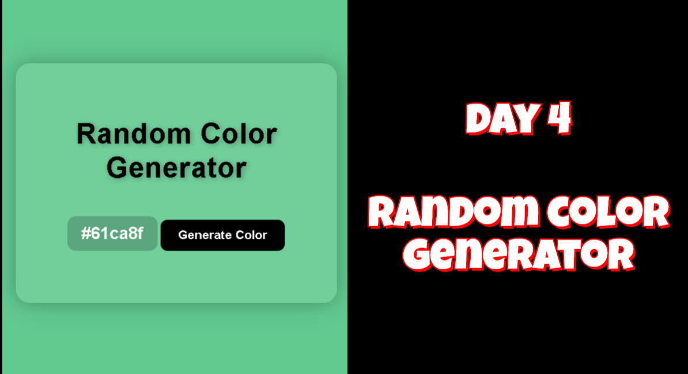

# 🌈 Day 4 - Random Color Generator

## 📸 Preview

  

A simple yet fun JavaScript project that generates a random background color and displays its hex code. Click the code to copy it instantly!

---

## 🚀 Features

- Random hex color generation  
- One-click background change  
- Click to copy hex code  
- Stylish UI with glassmorphism  
- Fully responsive design

---

## 🛠️ Tech Stack

- HTML  
- CSS (Flexbox, glassmorphism)  
- JavaScript (DOM manipulation, event handling)

---

## 🎥 Demo Video

Watch the full walkthrough on YouTube 👉 [Watch Now](https://youtu.be/RY73ijDqh7o)

---

## 🔗 Connect with Me

- 💼 [LinkedIn](https://linkedin.com/in/sneka-chandrasekaran)  
- 💻 [GitHub](https://github.com/snekaC2024)
  
---

## 🔜 Next Project

📅 **Day 5 - To-Do List App**  
Stay tuned for the next mini project in my 100 Days of JavaScript series!

---

## ✨ Made with 💻 by Sneka Chandrasekaran
